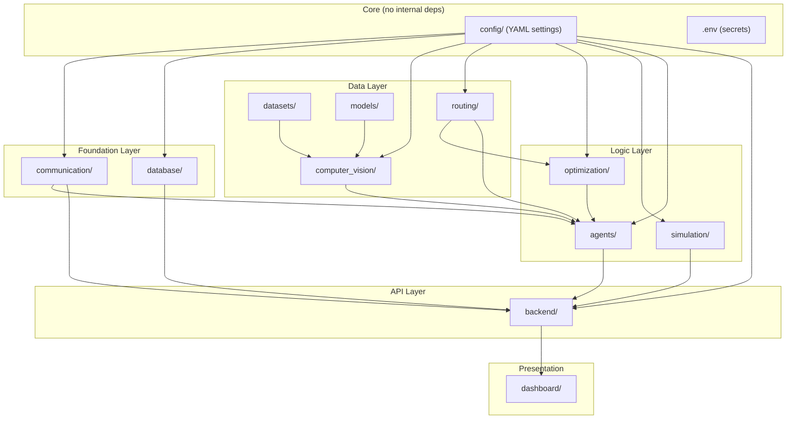

# Agentic AI Framework for Distributed Emergency Evacuation Optimization

Complete implementation plan for a multi-agent AI system that analyzes crowd data, assesses risk, monitors traffic/transportation, optimizes evacuation routes, and dynamically replans when conditions change — all orchestrated through a LangGraph workflow with a professional React dashboard.

## User Review Required

> [!IMPORTANT]
> **This is a very large project (~80+ source files).** It will be built in 11 phases. Each phase produces complete, working files. You approve each phase before I proceed to the next.

> [!IMPORTANT]
> **Demo Mode is the default.** The entire system runs without GPU, PostgreSQL, Redis, SUMO, OSRM, or LLM API keys. All external services have in-process fallbacks.

> [!WARNING]
> **LLM Integration:** The Coordinator Agent uses an LLM for reasoning/explanation. In demo mode, it uses a rule-based decision engine instead. All numerical route calculations are ALWAYS done by deterministic algorithms (NetworkX shortest path + custom cost functions), never by the LLM.

---

## Architecture Overview

```
┌─────────────────────────────────────────────────────────────────────┐
│                     REACT DASHBOARD (Vite)                         │
│  Map │ Crowd Panel │ Route Panel │ Traffic │ Agents │ Alerts       │
└──────────────────────────────┬──────────────────────────────────────┘
                               │ REST API (HTTP)
┌──────────────────────────────▼──────────────────────────────────────┐
│                     FASTAPI BACKEND                                 │
│  /api/emergency │ /api/crowd │ /api/routes │ /api/agents │ etc.    │
└──────┬───────────────┬───────────────┬──────────────────────────────┘
       │               │               │
┌──────▼───────┐ ┌─────▼──────┐ ┌──────▼──────┐
│  SERVICES    │ │  DATABASE  │ │  EVENT BUS  │
│              │ │ SQLAlchemy │ │ Redis/Local │
└──────┬───────┘ └────────────┘ └──────┬──────┘
       │                               │
┌──────▼───────────────────────────────▼──────────────────────────────┐
│                   LANGGRAPH AGENT WORKFLOW                          │
│                                                                     │
│  ┌──────────┐  ┌──────────┐  ┌──────────┐  ┌──────────────┐       │
│  │  Crowd   │→ │   Risk   │→ │ Traffic  │→ │ Transport    │       │
│  │  Agent   │  │  Agent   │  │  Agent   │  │    Agent     │       │
│  └──────────┘  └──────────┘  └──────────┘  └──────┬───────┘       │
│                                                     │               │
│  ┌──────────────┐  ┌────────────────────────┐      │               │
│  │    Route     │← │   Emergency            │←─────┘               │
│  │ Optimization │  │   Coordinator          │                      │
│  │    Agent     │→ │      Agent             │                      │
│  └──────────────┘  └────────────┬───────────┘                      │
│                                  │                                  │
│                    ┌─────────────▼──────────┐                      │
│                    │  Conditional Edges:    │                      │
│                    │  road_blocked → replan │                      │
│                    │  density_high → risk   │                      │
│                    │  capacity_exceeded →   │                      │
│                    │    redistribute        │                      │
│                    └────────────────────────┘                      │
└─────────────────────────────────────────────────────────────────────┘
       │                    │                    │
┌──────▼──────┐  ┌──────────▼──────┐  ┌──────────▼──────┐
│  COMPUTER   │  │  OPTIMIZATION   │  │  SIMULATION     │
│  VISION     │  │  ENGINE         │  │  ENGINE         │
│  Pipeline   │  │  NetworkX +     │  │  SUMO/Fallback  │
│  YOLO/Demo  │  │  Cost Functions │  │                 │
└─────────────┘  └─────────────────┘  └─────────────────┘
```

---

## Dependency Graph (Module-Level)



**Import Rule:** Arrows show allowed import directions. No module imports from a higher layer. `agents/` can import from `communication/`, `computer_vision/`, `routing/`, `optimization/`, `simulation/`, and `config/` but NOT from `backend/`.

---

## Technology Versions

| Technology | Version | Purpose |
|---|---|---|
| Python | 3.11+ | Runtime |
| FastAPI | 0.115+ | REST API |
| Pydantic | 2.x | Data validation |
| Uvicorn | 0.30+ | ASGI server |
| PyTorch | 2.x | ML framework |
| NumPy | 1.26+ | Numerical |
| Pandas | 2.x | Data manipulation |
| scikit-learn | 1.5+ | ML utilities |
| OpenCV | 4.10+ | Computer vision |
| Ultralytics | 8.x | YOLO object detection |
| LangGraph | 0.2+ | Agent orchestration |
| LangChain | 0.3+ | LLM tools/chains |
| langchain-openai | 0.2+ | OpenAI LLM provider |
| langchain-community | 0.3+ | Community integrations |
| NetworkX | 3.x | Graph algorithms |
| SQLAlchemy | 2.x | ORM |
| Redis (py) | 5.x | Pub/sub (optional) |
| React | 18.x | UI framework |
| Vite | 5.x | Frontend build |
| Leaflet | 1.9+ | Maps |
| Recharts | 2.x | Charts |
| pytest | 8.x | Testing |
| Docker | 24+ | Containers |
| Docker Compose | 2.x | Multi-container |

---

## Complete File Tree (80+ files)

```
emergency-evacuation-ai/
│
├── agents/
│   ├── __init__.py
│   ├── base_agent.py          # Abstract base with observe/analyze/act pattern
│   ├── crowd_agent.py         # Crowd monitoring & density analysis
│   ├── risk_agent.py          # Zone risk assessment (LOW/MED/HIGH/CRITICAL)
│   ├── traffic_agent.py       # Road conditions & congestion
│   ├── transport_agent.py     # Vehicle tracking & assignment
│   ├── route_agent.py         # Route optimization (calls NetworkX tools)
│   ├── coordinator_agent.py   # Orchestrator (LLM reasoning or rule-based)
│   ├── agent_state.py         # Pydantic/TypedDict shared state
│   ├── agent_messages.py      # Structured AgentMessage model
│   ├── tools.py               # LangChain tools agents can invoke
│   └── graph.py               # LangGraph workflow definition
│
├── computer_vision/
│   ├── __init__.py
│   ├── detector.py            # YOLO person detection (+ demo fallback)
│   ├── counter.py             # People counting from detections
│   ├── tracker.py             # Simple centroid/ByteTrack tracker
│   ├── density.py             # Density estimation (heatmap)
│   ├── zone_analyzer.py       # Zone-level crowd analytics
│   ├── video_processor.py     # Frame extraction from video/cam
│   └── inference.py           # Full CV pipeline orchestrator
│
├── datasets/
│   ├── __init__.py
│   ├── dronecrowd_loader.py   # DroneCrowd dataset loader
│   ├── nwpu_loader.py         # NWPU-Crowd loader
│   ├── ucf_qnrf_loader.py     # UCF-QNRF loader
│   ├── preprocessing.py       # Resize, normalize, augment
│   └── dataset_config.py      # Paths, splits, parameters
│
├── models/
│   ├── __init__.py
│   ├── model_manager.py       # Load/save model weights
│   ├── crowd_model.py         # Simple crowd counting CNN
│   └── weights/               # (gitignored, user places weights here)
│
├── optimization/
│   ├── __init__.py
│   ├── route_optimizer.py     # Shortest-path with custom cost
│   ├── evacuation_optimizer.py# Multi-zone people-to-exit assignment
│   ├── cost_function.py       # Weighted cost: dist+time+risk+congestion
│   ├── constraints.py         # Exit capacity, road capacity
│   └── assignment.py          # Linear assignment solver
│
├── routing/
│   ├── __init__.py
│   ├── graph_builder.py       # Build NetworkX graph from road data
│   ├── osrm_client.py         # Optional OSRM API client
│   ├── route_service.py       # High-level routing facade
│   └── map_data.py            # Demo map data (nodes, edges)
│
├── simulation/
│   ├── __init__.py
│   ├── crowd_simulator.py     # Simulated crowd movement
│   ├── traffic_simulator.py   # Simulated road conditions
│   ├── evacuation_simulator.py# Evacuation progress tracker
│   ├── scenario_manager.py    # Load/manage scenarios
│   ├── sumo_client.py         # Optional SUMO/TraCI interface
│   └── fallback_simulator.py  # Full fallback (no SUMO needed)
│
├── backend/
│   ├── __init__.py
│   ├── main.py                # FastAPI app creation & startup
│   ├── config.py              # Settings from .env + YAML
│   ├── dependencies.py        # FastAPI dependency injection
│   ├── api/
│   │   ├── __init__.py
│   │   ├── emergency.py       # /api/emergency/*
│   │   ├── crowd.py           # /api/crowd/*
│   │   ├── routes.py          # /api/routes
│   │   ├── traffic.py         # /api/traffic
│   │   ├── agents.py          # /api/agents
│   │   ├── simulation.py      # /api/simulation/*
│   │   └── dashboard.py       # /api/dashboard/summary
│   ├── schemas/
│   │   ├── __init__.py
│   │   ├── emergency.py       # Emergency Pydantic models
│   │   ├── crowd.py           # Crowd Pydantic models
│   │   ├── route.py           # Route Pydantic models
│   │   ├── traffic.py         # Traffic Pydantic models
│   │   └── agent.py           # Agent Pydantic models
│   └── services/
│       ├── __init__.py
│       ├── emergency_service.py
│       ├── crowd_service.py
│       ├── route_service.py
│       └── simulation_service.py
│
├── database/
│   ├── __init__.py
│   ├── database.py            # Engine, session, Base
│   ├── models.py              # ORM models
│   ├── repositories.py        # CRUD operations
│   └── seed.py                # Demo data seeding
│
├── communication/
│   ├── __init__.py
│   ├── redis_client.py        # Redis pub/sub wrapper
│   ├── event_bus.py           # Abstract event bus interface
│   └── local_bus.py           # In-process event bus fallback
│
├── dashboard/
│   ├── package.json
│   ├── vite.config.js
│   ├── index.html
│   └── src/
│       ├── main.jsx
│       ├── App.jsx
│       ├── api.js
│       ├── components/
│       │   ├── MapView.jsx
│       │   ├── CrowdPanel.jsx
│       │   ├── RoutePanel.jsx
│       │   ├── TrafficPanel.jsx
│       │   ├── AgentStatus.jsx
│       │   ├── Alerts.jsx
│       │   ├── Statistics.jsx
│       │   └── EmergencyControls.jsx
│       └── styles/
│           └── app.css
│
├── tests/
│   ├── __init__.py
│   ├── conftest.py
│   ├── test_agents.py
│   ├── test_crowd.py
│   ├── test_routing.py
│   ├── test_optimization.py
│   ├── test_simulation.py
│   └── test_api.py
│
├── scripts/
│   ├── seed_demo.py
│   ├── run_demo.py
│   ├── test_system.py
│   └── train_model.py
│
├── config/
│   ├── settings.yaml
│   ├── scenarios.yaml
│   └── thresholds.yaml
│
├── data/
│   ├── raw/                   # (gitignored, user places datasets)
│   ├── processed/             # (gitignored, preprocessed data)
│   ├── demo/                  # Demo scenario data
│   └── maps/                  # Map/graph data
│
├── notebooks/
│   ├── crowd_analysis.ipynb
│   └── evacuation_analysis.ipynb
│
├── requirements.txt
├── .env.example
├── .gitignore
├── Dockerfile
├── docker-compose.yml
├── README.md
└── run.py
```

---

## Proposed Changes — Phase by Phase

### Phase 1: Foundation & Configuration

#### [MODIFY] [requirements.txt](file:///c:/Users/saras/OneDrive/Desktop/emergency-evacuation-ai/requirements.txt)
Complete pinned dependencies for all modules.

#### [NEW] [.env.example](file:///c:/Users/saras/OneDrive/Desktop/emergency-evacuation-ai/.env.example)
All configurable environment variables with safe defaults.

#### [NEW] [.gitignore](file:///c:/Users/saras/OneDrive/Desktop/emergency-evacuation-ai/.gitignore)
Python, Node, IDE, data, and model weights exclusions.

#### [NEW] [config/settings.yaml](file:///c:/Users/saras/OneDrive/Desktop/emergency-evacuation-ai/config/settings.yaml)
Application-level settings (server, database, agents, routing).

#### [NEW] [config/scenarios.yaml](file:///c:/Users/saras/OneDrive/Desktop/emergency-evacuation-ai/config/scenarios.yaml)
Demo scenario definitions (4 zones, roads, exits, vehicles).

#### [NEW] [config/thresholds.yaml](file:///c:/Users/saras/OneDrive/Desktop/emergency-evacuation-ai/config/thresholds.yaml)
Risk thresholds, density thresholds, capacity limits.

---

### Phase 2: Agents (`agents/`)

All 10 files implementing the multi-agent system:

- **base_agent.py** — Abstract base class with `observe()`, `analyze()`, `act()`, `report()` lifecycle
- **agent_state.py** — `TypedDict` for LangGraph shared state containing zone data, risk levels, traffic, routes, etc.
- **agent_messages.py** — `AgentMessage` Pydantic model with sender, receiver, type, payload, priority
- **tools.py** — LangChain `@tool` functions: `calculate_route`, `get_crowd_density`, `get_road_status`, `assign_vehicles`, `optimize_evacuation`
- **crowd_agent.py** — Processes CV output, produces zone-level crowd counts/density
- **risk_agent.py** — Computes risk scores (LOW/MEDIUM/HIGH/CRITICAL) per zone
- **traffic_agent.py** — Monitors road conditions, detects blocked/congested roads
- **transport_agent.py** — Tracks vehicles, assigns to zones based on need
- **route_agent.py** — Invokes deterministic NetworkX routing, respects blocked roads
- **coordinator_agent.py** — LLM-based reasoning (or rule-based in demo) to orchestrate all agents
- **graph.py** — LangGraph `StateGraph` with nodes for each agent, conditional edges for replanning

Key design decisions:
- LangGraph `StateGraph` with `TypedDict` state (not Pydantic, as LangGraph prefers TypedDict)
- Each agent is a Python function (LangGraph node), not a class — but each function delegates to an agent class for clean encapsulation
- Conditional edges: `should_replan()` checks for blocked roads, density spikes, capacity overflow
- The LLM ONLY reasons about strategy; all numerical work is done by tools

---

### Phase 3: Computer Vision, Datasets, Models

**computer_vision/** — 7 files:
- YOLO-based person detector with graceful fallback to synthetic detections
- Counting: simple detection count + density-weighted counting
- Tracker: centroid-based tracker (ByteTrack-style simplified)
- Density: grid-based density estimation from detections
- Zone analyzer: maps detections to predefined zones
- Video processor: OpenCV frame extraction
- Inference: full pipeline orchestrator

**datasets/** — 5 files:
- Loaders for DroneCrowd, NWPU-Crowd, UCF-QNRF
- Each validates paths, provides clear error messages, supports train/test split
- Preprocessing: resize, normalize, generate density maps

**models/** — 3 files:
- Simple crowd counting CNN (for training on datasets)
- Model manager: load/save weights, handle missing files gracefully

---

### Phase 4: Routing & Optimization

**routing/** — 4 files:
- `graph_builder.py`: Constructs NetworkX DiGraph from road data with attributes (length, time, capacity, congestion, risk, blocked)
- `osrm_client.py`: Optional OSRM HTTP client
- `route_service.py`: Facade selecting OSRM or NetworkX
- `map_data.py`: Demo map definition (4 zones, ~15 roads, 4 exits)

**optimization/** — 5 files:
- `cost_function.py`: Weighted multi-criteria cost = w₁·dist + w₂·time + w₃·congestion + w₄·risk; blocked roads → ∞
- `route_optimizer.py`: Dijkstra with custom cost function
- `evacuation_optimizer.py`: Distributes people across exits using linear programming (scipy.optimize.linprog)
- `constraints.py`: Exit capacity, road capacity validation
- `assignment.py`: Zone-to-exit assignment solver

---

### Phase 5: Simulation

**simulation/** — 6 files:
- `crowd_simulator.py`: Simulates crowd generation, movement, evacuation progress
- `traffic_simulator.py`: Simulates road congestion changes, road blocking
- `evacuation_simulator.py`: Tracks overall evacuation progress, statistics
- `scenario_manager.py`: Loads scenarios from YAML, manages scenario lifecycle
- `sumo_client.py`: Optional SUMO/TraCI wrapper (no-op if SUMO unavailable)
- `fallback_simulator.py`: Complete self-contained simulator for demo mode

---

### Phase 6: Database & Communication

**database/** — 4 files:
- `database.py`: SQLAlchemy engine (PostgreSQL or SQLite fallback)
- `models.py`: ORM models for Emergency, Zone, CrowdObservation, Road, EvacuationExit, Vehicle, Route, AgentEvent, EvacuationPlan
- `repositories.py`: CRUD operations
- `seed.py`: Populate demo data

**communication/** — 3 files:
- `event_bus.py`: Abstract `EventBus` protocol
- `redis_client.py`: Redis pub/sub implementation
- `local_bus.py`: In-memory event bus (default in demo mode)

---

### Phase 7: Backend

**backend/** — 16 files:
- `main.py`: FastAPI app, lifespan events, CORS, router mounting
- `config.py`: Settings loaded from .env + YAML
- `dependencies.py`: FastAPI `Depends` for DB session, services
- **api/**: 7 router files for all endpoints listed in requirements
- **schemas/**: 5 Pydantic model files
- **services/**: 4 service files connecting API to agents/simulation/database

---

### Phase 8: Dashboard

**dashboard/** — 14 files:
- Vite + React project
- Leaflet map showing zones, roads, exits, routes, vehicles
- Recharts for crowd/evacuation statistics
- Real-time polling (5-second intervals)
- Emergency control buttons
- Agent status panel
- Alerts panel
- Professional dark-theme UI with glassmorphism

---

### Phase 9: Tests & Scripts

**tests/** — 7 test files + conftest:
- Unit tests for each major module
- API integration tests with FastAPI TestClient

**scripts/** — 4 files:
- `seed_demo.py`: Populate database with demo data
- `run_demo.py`: Run complete demo scenario
- `test_system.py`: End-to-end system test
- `train_model.py`: Train crowd counting model on datasets

---

### Phase 10: Docker, README, Entry Point

- `Dockerfile`: Multi-stage Python + Node build
- `docker-compose.yml`: Backend, frontend, PostgreSQL, Redis
- `README.md`: Complete documentation (all 22 sections)
- `run.py`: Entry point that starts everything in demo mode

---

### Phase 11: Consistency Audit

Full cross-reference check of all imports, functions, classes, API calls, and configurations.

---

## Open Questions

> [!IMPORTANT]
> **LLM Provider:** In demo mode, no LLM is needed (rule-based coordinator). When you do have an API key, which provider do you prefer?
> - **OpenAI** (GPT-4o-mini recommended for cost)
> - **Google Gemini**
> - **Anthropic Claude**
> - **Ollama** (local, free)
> 
> The code will support all via a configurable `LLM_PROVIDER` env var. Default will be OpenAI-compatible.

> [!NOTE]
> **SciPy for optimization:** I'll add `scipy` to requirements.txt for `scipy.optimize.linprog` used in evacuation assignment. This is a lightweight, well-tested solver — better than hand-rolling LP for distributing people to exits.

---

## Verification Plan

### Automated Tests
```bash
# Run all unit tests
pytest tests/ -v

# Run end-to-end system test
python scripts/test_system.py

# Run demo scenario
python run.py
```

### Manual Verification
1. Start backend: `python run.py` → verify API at http://localhost:8000/docs
2. Start dashboard: `cd dashboard && npm run dev` → verify UI at http://localhost:5173
3. Click "Start Emergency" → verify agents activate, routes appear on map
4. Click "Block Road" → verify agents detect change, routes recalculate
5. Verify evacuation progress updates in real-time
